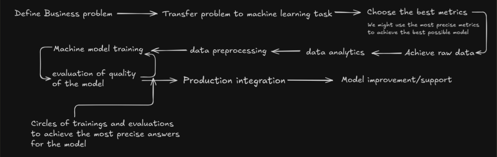

# __СommentGuard__
 is an **AI-powered system** that automatically detects **toxic, spammy, or fraudulent comments/reviews**.  
The goal of this project is to practice the **end-to-end ML pipeline**: from data collection and model training to deployment and monitoring.  

The project is designed as an end-to-end machine learning system, focusing not only on model training but also on evaluation, scalability, and future production integration.

### __🎯Primary goal: demonstrate a structured ML development process, from problem formulation to model improvement and deployment readiness.__

# 📌Overview

Online platforms require scalable and reliable moderation systems.
CommentGuard explores how classical and modern NLP techniques can be applied to multilabel text classification problems in real-world scenarios.

#### Key characteristics:

- Multilabel text classification

- Strong baseline before deep learning

- Metric-driven evaluation

- Focus on ML lifecycle, not just accuracy

# 🧠Project Development Philosophy

- This project follows a systematic machine learning lifecycle, illustrated below.
- 

- The workflow emphasizes:
 
- translating a business problem into an ML task

- selecting appropriate evaluation metrics

- iterative training and evaluation cycles
 
- continuous improvement after deployment

- This approach helps avoid common beginner mistakes such as premature model complexity or misleading metric optimization.

# ⚙️Tech Stack

## Core:

- __Python 3.10+__

- __Pandas, NumPy__

- __Scikit-learn__ 
## Attachment:

- NLP & ML

- TF-IDF

- Logistic Regression (One-vs-Rest)

- HuggingFace Transformers (planned)

- Engineering & MLOps

- FastAPI (planned)

- Docker (planned)

- MLflow / Monitoring (planned)

# 🧪 Machine Learning Approach
__Problem Type:__

- Multilabel text classification

- Each comment can belong to multiple categories simultaneously

## Labels Examples:

- Toxic
 
- Abusive

- Threat

- Hate speech

- Sexist

- Racist

- Religious hate

- Radicalism

*(full list available in code)*

## Baseline Model

#### __The current baseline uses:__

- TF-IDF (unigrams + bigrams)

- Logistic Regression

- One-vs-Rest strategy

#### __This model provides:__ 

- fast training

- strong interpretability

- a reliable reference point for future improvements

# 📊 Evaluation

Evaluation focuses on multilabel-aware metrics:

- F1-score (macro)

- Precision

- Recall

- Accuracy (for reference)

## Cross-validation is used to:

- reduce overfitting

- reveal label imbalance issues

- assess model stability

- Rare labels are explicitly analyzed, as they strongly influence macro metrics.

# 🚧 Project Status

### __The project is under active development.__

#### __Completed__:

✅ Data preprocessing

✅ Multilabel baseline model

✅ Cross-validation & metric analysis

✅ Pipeline-based training

## Work in Progress

🔄 Improving performance on rare labels

🔄 Metric comparison and threshold tuning

#### __Planned__:

- DistilBERT / RoBERTa fine-tuning

- FastAPI inference service

- Model monitoring and retraining

- Experiment tracking (MLflow)